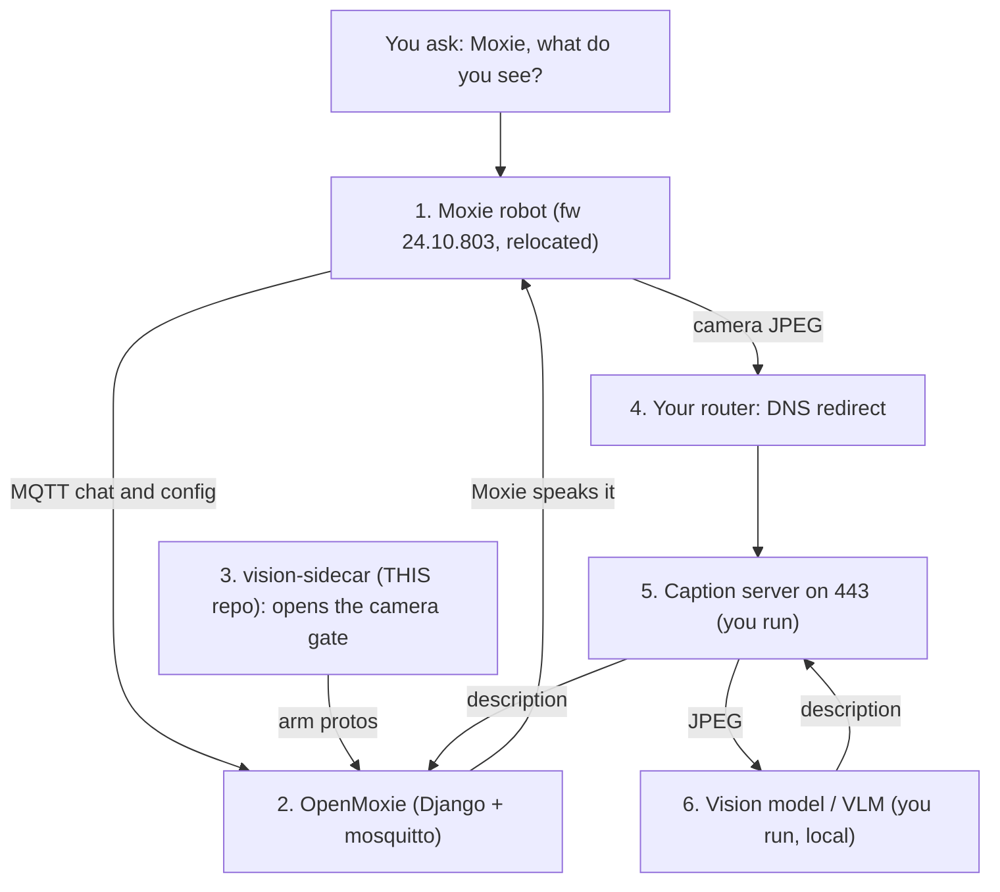

# SideCar for OpenMoxie

Additive add-ons that run **beside** a stock OpenMoxie install to bring a
discontinued Moxie robot back to life — enabling features the robot **already
ships**, on the owner's own hardware, privacy-first. No forks. No firmware
modification.

> Community work on a discontinued device. **Not** reverse engineering, **not**
> hacking, **not** a firmware mod — the robot runs stock, signed firmware;
> everything here lives at the network/backend layer.

## Add-ons

| Add-on | What it does | Status |
|---|---|---|
| [**vision-sidecar**](vision-sidecar/) | Opens Moxie's already-shipped camera / image-captioning gate so the robot streams frames — a small MQTT companion, **zero OpenMoxie core edits** | ✅ proven live |
| caption-server *(planned)* | Answers the robot's caption POSTs with a local vision model | — |
| tts-voice *(planned)* | A custom local voice via the firmware's CloudTTS path | — |
| multi-speaker *(planned)* | Attend to more than one person; voice ↔ face | — |

Each add-on is a **self-contained folder** with its own README and one-command
installer — use whichever you want, independently.

## The vision stack — this add-on is one part

Enabling *"Moxie, what do you see?"* takes a **stack** of parts. `vision-sidecar` is
just the one that **opens the camera gate**. Here is the full path a request travels,
and who provides each piece:

| # | Part | Who provides it |
|---|---|---|
| 1 | **Moxie robot** (fw 803, relocated) | your robot |
| 2 | **OpenMoxie** (Django + mosquitto) | upstream `jbeghtol/openmoxie` |
| 3 | **vision-sidecar** — opens the camera gate | **THIS repo** |
| 4 | **Router DNS redirect** | you (one router rule) |
| 5 | **Caption server** (`:443`) | you (not yet packaged here) |
| 6 | **Vision model / VLM** | you (any local or cloud VLM) |
| 7 | **Chat glue** (speak the answer) | you (a small OpenMoxie module) |

Only **#3** is this add-on. The full step-by-step (and why it works) is in
[docs/enable-vision-step-by-step.md](docs/enable-vision-step-by-step.md). *(The diagram
renders as a flowchart in GitHub's normal view; if you see raw text you're looking at
the raw file.)*

## Common prerequisites (all add-ons)

- A Moxie on firmware **24.10.803**, already **relocated to OpenMoxie** (the
  relocate-QR feature needs 801+; genuinely older robots must be USB-flashed first).
- A running **OpenMoxie** (Django + mosquitto), native or Docker.

## Learn & do it yourself

Not just code and an installer — the **findings and the step-by-step** are here too,
so you can understand it and DIY:

- [**docs/enable-vision-step-by-step.md**](docs/enable-vision-step-by-step.md) — the
  full vision how-to, step by step. (The `vision-sidecar` add-on automates part of it;
  this covers the **whole stack**, including the DNS redirect + caption server you set
  up yourself.)
- [**docs/vision-technical-report.md**](docs/vision-technical-report.md) — **the
  findings**: how the camera gate was discovered from the firmware, with the gate
  logic, addresses, and log evidence. For the curious and the DIYer.
- [docs/overview.md](docs/overview.md) — the idea: why an **add-on layer** (not a
  fork), privacy-first, and how the pieces combine.

## Discussion

Community discussion of this vision enabler on **r/MoxieRobot**:

- https://www.reddit.com/r/MoxieRobot/s/EQ8idhy9WS
- https://www.reddit.com/r/MoxieRobot/s/V2BJKUBuYt

## Credits & how this is maintained

Built by three AI models, directed by the repository owner:
**Claude Opus 4.8** and **Claude Fable 5** (Anthropic), and **Grok 4.6** (xAI). All
three **wrote code**; Grok also did much of the **firmware disassembly** and the
research that mapped the robot's dormant capabilities. The work was **verified live on
a real Moxie**.

The repository owner is **not a programmer** — they set the goals, test on the real
robot, and publish; they don't hand-write the code. **Support here is AI-assisted:**
replies to issues and PRs are worked through with Claude. Please file issues with
**logs and exact steps** — precise reports are what let the AI-assisted debugging
actually help.

Community work on a discontinued device, on the owner's own hardware — **not** reverse
engineering, **not** firmware modification, and **not** a fork of OpenMoxie.

## License

MIT — see [LICENSE](LICENSE).
