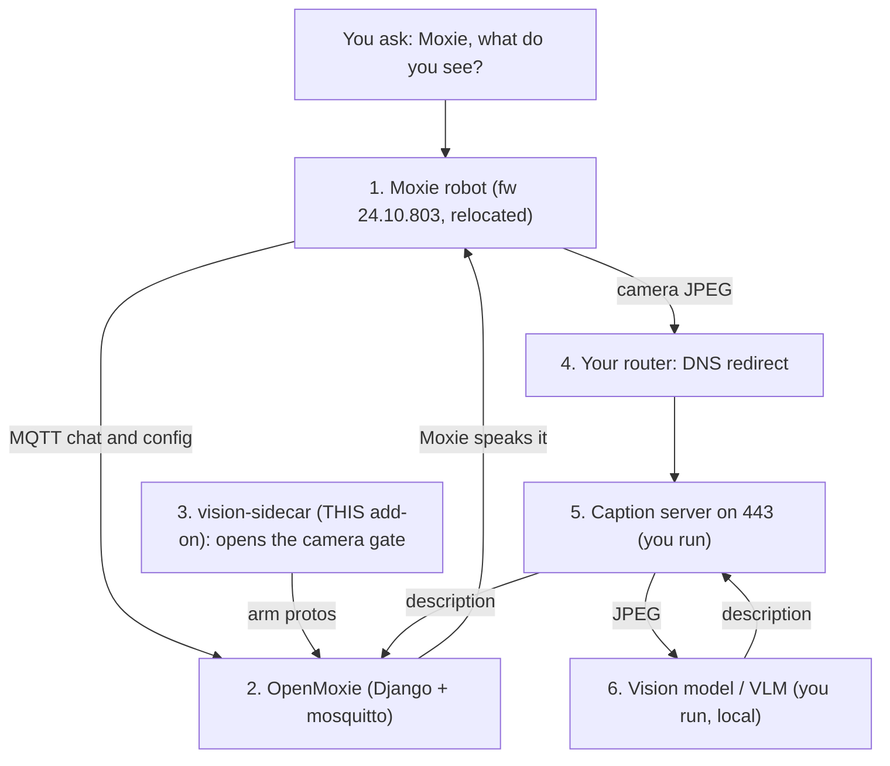

# vision-sidecar — additive image-captioning gate for stock OpenMoxie

An independent process that runs **beside** an unpatched OpenMoxie install and
opens the robot's **already-shipped** camera / image-captioning path. No
OpenMoxie source file is edited. The robot stays on **stock, signed firmware**.

This is community work around a discontinued device, on the **owner's own
hardware**, at the network/backend layer. It is **not** reverse engineering,
**not** firmware modification, and **not** a fork of OpenMoxie.

### This add-on is ONE part of a stack

It opens the camera gate — *seeing* also needs a DNS redirect, a caption server, and a
vision model.

**In plain terms (non-developer).** Getting Moxie to describe what it sees takes three
things on your side:

1. **Install this add-on** — one command (`./install.sh`); it switches Moxie's camera on.
2. **Point Moxie's photos to your computer** — one setting on your home router (a *DNS
   redirect*): send `production-ic-worker.embodied.com` to your computer's address. Moxie
   posts each camera photo to that name, so this makes the photos arrive at your computer
   instead of the shut-down company servers.
3. **Run a small "caption server" on your computer** — it catches each photo, **saves it
   to a folder so you can open and see what Moxie saw**, and returns a short description
   that Moxie speaks. *(This piece is coming as its own add-on; until then the step-by-step
   below shows how to run one.)*

**Where the photos are saved:** the caption server writes each incoming photo to a
`frames/` folder (e.g. `frames/frame_*.jpg`) — open it any time to browse the stills Moxie
captured. They're small (320×180), roughly one per second while Moxie is awake and engaged.

**For developers — the full path** a "Moxie, what do you see?" request travels:



| # | Part | Who provides it |
|---|---|---|
| 1 | **Moxie robot** (fw 803, relocated) | your robot |
| 2 | **OpenMoxie** (Django + mosquitto) | upstream `jbeghtol/openmoxie` |
| 3 | **vision-sidecar** — opens the camera gate | **THIS add-on** |
| 4 | **Router DNS redirect** | you (one router rule) |
| 5 | **Caption server** (`:443`) | you (not yet packaged here) |
| 6 | **Vision model / VLM** | you (any local or cloud VLM) |
| 7 | **Chat glue** (speak the answer) | you (a small OpenMoxie module) |

Only **#3** is this add-on. Full step-by-step + why it works:
[docs/enable-vision-step-by-step.md](docs/enable-vision-step-by-step.md) · the findings:
[docs/vision-technical-report.md](docs/vision-technical-report.md).

**Status: proven and in use.** The arm path was verified on-robot (A/B test:
the in-core arm senders disabled, this sidecar the only thing arming — the
robot booted with the capture gate closed and camera frames streamed once
the sidecar armed it). It now runs as a managed service and has replaced the
in-core arming on the author's own install. One honest caveat remains: the
sidecar's `client-service-http-token` reply was **not** isolated in that test
(the stock server still answered the token request), so whether the token
reply is required — and whether this sidecar's version of it is correct — is
unverified standalone. If a fully-stock install sees no frames, that reply is
the first thing to suspect. See **Open questions** below.

## What it does

Three cooperating pieces, all additive:

1. **`apply_vision_config.py`** — one-shot write to the Django
   `HiveConfiguration(name='default')` row: `data_sharing="full"` plus props
   `image_captioning="1"`, `ic_by_rb="1"`, `gcp_upload_disable="0"`. That row
   is the substitute for editing `DEFAULT_ROBOT_CONFIG` /
   `DEFAULT_ROBOT_SETTINGS` in `site/hive/mqtt/robot_data.py`. The merge is
   additive (existing keys are preserved). See the script's header comment
   for why: `build_config()` uses the row **wholesale**.
2. **`vision_sidecar.py`** — MQTT client on the same broker as OpenMoxie.
   It arms a robot from **two** triggers: a mosquitto `$SYS/broker/log/#`
   connect line (fresh boot), **and** any message on `/devices/+/events/#`
   (a live robot emits events constantly). The event trigger is essential —
   the `$SYS` connect line only fires on a *new* broker session, so a
   sidecar that starts while the robot is already connected, or a robot that
   **wakes from suspend** (its MQTT session survives, no new connect line),
   would never be armed by the connect trigger alone. On either trigger it
   publishes the two arm protos (`LoggingStateUpdate` then `EnableICModule`)
   to `/devices/{id}/commands/zmq` **once per connection** — a broker-log
   disconnect clears the flag so the next boot arms exactly once, never as a
   heartbeat (see "Arming safely"). Optionally
   answers `client-service-http-token` with a dummy token.
3. **LaunchAgent template** — keep the sidecar up across logins.

DNS redirect of `production-ic-worker.embodied.com` (and friends) to a local
caption server is **out of scope of this package**. The robot still POSTs
JPEGs to that vendor hostname; something else (router DNS + the existing
caption server on :443) has to answer. This sidecar only opens the firmware
gate that makes those POSTs happen. For those steps (and the full picture), see
[docs/enable-vision-step-by-step.md](docs/enable-vision-step-by-step.md) and
the findings in [docs/vision-technical-report.md](docs/vision-technical-report.md).

## Prerequisites

- A running OpenMoxie (Django + local mosquitto). Default broker:
  `localhost:8883`. OpenMoxie's mosquitto has a **TLS listener** on 8883, so
  this sidecar connects **over TLS** with `tls_set(cert_reqs=CERT_NONE)` +
  `tls_insecure_set(True)` — encrypt, don't verify the self-signed cert,
  mirroring OpenMoxie's own client. (A plaintext connect hangs with no
  CONNACK.) Auth is **anonymous** first, then username `unknown` with no
  password. If the broker ACL rejects both, add an operator user that can:
  - read `$SYS/broker/log/#`
  - read `/devices/+/events/#` (only if http-token replies stay enabled)
  - write `/devices/+/commands/#`
- Python venv with **paho-mqtt** and **protobuf** (the OpenMoxie venv
  already has both).
- The caption-server / DNS pieces above, if you actually want frames.

## Quick install (one command)

```bash
./install.sh                       # if your OpenMoxie is at ~/openmoxie
./install.sh /path/to/openmoxie    # otherwise
```

`install.sh` is fully commented — open it first; it does nothing hidden and never
uses sudo. It checks the venv deps, applies the DB config (step 1 below), and
installs + starts a **user** LaunchAgent running the sidecar (steps 2–3 below).
Idempotent, so it's safe to re-run. **Uninstall:** `./uninstall.sh` (see below).

> This installs the **gate-opener only**. To actually *see* descriptions you still
> need the DNS redirect + caption server (see Prerequisites above).

## Install with Docker (if you run OpenMoxie in Docker)

OpenMoxie ships a `docker compose` setup (`mqtt` + `server`). This add-on includes
an **overlay** that plugs into it. Put this folder at your OpenMoxie repo root as
`./vision-sidecar`, then from that root run **one command**:

```bash
docker compose -f docker-compose.yml \
               -f vision-sidecar/docker-compose.vision.yml up -d --build
```

That adds two services: a one-shot `vision-config` (writes the DB config using
OpenMoxie's own server image + DB volume) and the long-running `vision-sidecar`
(talks to the `mqtt` broker service). Remove with `docker compose ... down`.
Nothing hidden — read `docker-compose.vision.yml`; it edits no OpenMoxie source.

> **Status — Docker path mechanics verified.** In an isolated Docker test the image
> builds, this overlay **merges cleanly** with OpenMoxie's base compose, and the
> containerized sidecar **connects to OpenMoxie's TLS broker and arms on a device
> event** (publishes the two protos). Not yet confirmed end-to-end by the authors:
> the `vision-config` one-shot writing to a live server DB, and real frames from an
> actual robot — that full path is proven on the **native** install. If you run this
> on Docker OpenMoxie, please open an issue with what you see. One known nuance (and
> its fix) is documented at the top of `docker-compose.vision.yml`.

## Install / run — manual (exactly what `install.sh` automates)

From the OpenMoxie repo root (or this add-on sitting next to a clone).

### 1. Apply the DB-row config (once; idempotent)

Settings module is `openmoxie.settings` (same bootstrap as `site/load_see.py`).
`--site-dir` must point at the **live** OpenMoxie `site/` that owns the
SQLite DB, which may not be this worktree.

```bash
DJANGO_SETTINGS_MODULE=openmoxie.settings \
  /path/to/openmoxie/venv/bin/python vision-sidecar/apply_vision_config.py \
  --site-dir /path/to/openmoxie/site
```

It prints pretty-JSON before/after of `common_config` and `common_settings`,
then saves. A second run prints the same and says `Unchanged (idempotent)`.

A robot already connected will pick the new config up on its **next** config
fetch (typically the next MQTT connect / session). This script does not
push `/config` itself.

### 2. Run the sidecar

```bash
/path/to/openmoxie/venv/bin/python vision-sidecar/vision_sidecar.py \
  --broker-host localhost \
  --broker-port 8883
```

Flags (each has an env fallback):

| flag | env | default |
|---|---|---|
| `--broker-host` | `VISION_SIDECAR_BROKER_HOST` | `localhost` |
| `--broker-port` | `VISION_SIDECAR_BROKER_PORT` | `8883` |
| `--http-token` / `--no-http-token` | `VISION_SIDECAR_HTTP_TOKEN` | on |
| `--resend-interval` seconds | `VISION_SIDECAR_RESEND_INTERVAL` | `0` (leave at 0 — see note below) |

**Arming happens at most twice per connection — leave `--resend-interval` at `0`.** The
arm messages are events, not a heartbeat. Boot sequence: a **best-effort** arm fires the
moment the robot connects, and the **latching** arm fires on the device's **first
perception event** (events flowing proves the vision subsystem is up and listening) — so
**at most 2 arms per connection**. A broker-log disconnect clears the flag, so the next
boot starts fresh. Setting `--resend-interval > 0` re-sends the arm protos on a timer,
which can overload the robot's audio subsystem — so don't.

Logs to stdout:

- `VISION-ARM dev=<device_id> sent 2 protos`
- `VISION-HTTP-TOKEN dev=<device_id>`

### 3. Optional: user LaunchAgent

`com.openmoxie.vision-sidecar.plist` is a **template**. `@HOME@` is a
placeholder so the file is safe to publish. Substitute it, and fix the clone
path if it is not `$HOME/openmoxie`:

```bash
sed "s|@HOME@|$HOME|g" vision-sidecar/com.openmoxie.vision-sidecar.plist \
  > ~/Library/LaunchAgents/com.openmoxie.vision-sidecar.plist
# edit the plist if your clone is not $HOME/openmoxie
launchctl bootstrap gui/$(id -u) ~/Library/LaunchAgents/com.openmoxie.vision-sidecar.plist
```

This is a **user** LaunchAgent, not the root caption daemon. Do not
`sudo launchctl` it, and do not `launchctl kickstart` the OpenMoxie web
server as part of this install (that breaks the robot's STT handshake).

## Open questions (not yet isolation-tested)

The arm path is proven (see **Status**). These two remain, and want a run on
**fully stock** OpenMoxie (no core patch at all) plus this sidecar:

**(a)** Is the http-token reply actually required, or is the robot's
captioning path tolerant of it being absent? The A/B did not isolate this —
the stock server answered the token during the test. (`--no-http-token` vs
default on, with core `_PROVIDE_HTTP_TOKENS` off.)

**(b)** Is `data_sharing="full"` alone sufficient without the two arm
protos, or are the protos load-bearing? (Run apply_vision_config only,
leave the sidecar off — vs both.)

Neither blocks use: the full stack (sidecar arming + token on + config) is
proven to stream frames. These would just find the *minimal* stack.

## Uninstall / rollback

```bash
./uninstall.sh                       # stop + remove the LaunchAgent
./uninstall.sh --show-config-revert  # also print how to clear the DB config
```

The uninstaller stops and removes the user LaunchAgent, so the sidecar no longer
runs and the camera gate is no longer armed. The DB config is left in place by
default — it is **inert** without the sidecar (nothing arms the gate). No sudo, and
no OpenMoxie source is touched.

**By hand**, if you prefer:

```bash
launchctl bootout gui/$(id -u)/com.openmoxie.vision-sidecar
rm ~/Library/LaunchAgents/com.openmoxie.vision-sidecar.plist
```

## Discussion

Community discussion of this vision enabler on **r/MoxieRobot**:

- https://www.reddit.com/r/MoxieRobot/s/EQ8idhy9WS
- https://www.reddit.com/r/MoxieRobot/s/V2BJKUBuYt

## Credits & how this is maintained

Built by three AI models, directed by the repository owner: **Claude Opus 4.8** and
**Claude Fable 5** (Anthropic), and **Grok 4.6** (xAI). All three **wrote code**; Grok
also did much of the **firmware disassembly** and the research that mapped the camera
gate. The camera-enable path was **A/B-proven live on a real Moxie** and ships with a
test suite.

The repository owner is **not a programmer** — they set the goals, test on the real
robot, and publish; they don't hand-write the code. **Support here is AI-assisted:**
replies to issues and PRs are worked through with Claude. Please include **logs and
exact steps** in issues — precise reports are what make the AI-assisted debugging work.

Community work on a discontinued device, on the owner's own hardware — **not** reverse
engineering, **not** firmware modification, and **not** a fork of OpenMoxie.

## Tests (no live broker, no live Django DB)

`pytest` is not required. From the repo root:

```bash
/path/to/openmoxie/venv/bin/python -m unittest vision-sidecar/test_vision_sidecar.py -v
```

(If pytest is installed in the venv, `python -m pytest vision-sidecar/test_vision_sidecar.py -v`
also collects these tests.)
