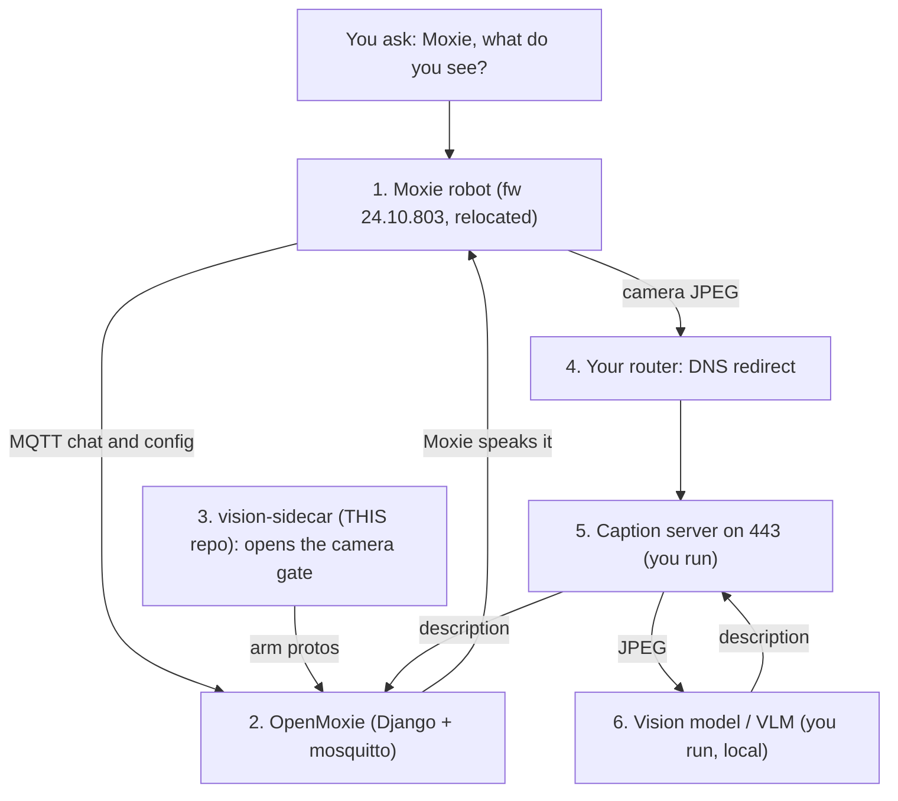

# Enabling Moxie's Vision ("describe what you see") on OpenMoxie

Firmware **v24.10.803** (Embodied's last official build) already contains the full
image‑captioning / "vision intelligence" pipeline. It is **off by default** and is
turned on **entirely from the backend** — no firmware change, no root, no special key.
This is the exact minimum recipe that works.

> Setup this was verified on: a Mac running OpenMoxie (Django + mosquitto), a local
> vision‑language model, and a network router capable of custom DNS overrides. Nothing
> here is specific to that hardware — any OpenMoxie host works.

> **Using this repo's [`vision-sidecar`](..) add-on?** It **automates
> steps 1–3** below (the config, the http‑token reply, and the two arm messages), so
> with the add‑on you only do **steps 4–5** (the DNS redirect + a caption server). This
> page explains what's happening under the hood — and lets you do the whole thing by
> hand if you prefer. For *why* it works (the firmware detective story), see
> [vision-technical-report.md](vision-technical-report.md).

---

## What you need — the whole "describe what you see" stack

Enabling vision is a **stack of parts**, not one thing. `vision-sidecar` (this repo)
is **one** of them — the piece that opens the camera gate. Here is the full path a
"Moxie, what do you see?" request travels, and who provides each piece:



| # | Part | Role | Who provides it |
|---|---|---|---|
| 1 | **Moxie robot** (fw 803, relocated) | the camera + the voice | your robot |
| 2 | **OpenMoxie** (Django + mosquitto) | the backend the robot talks to | upstream `jbeghtol/openmoxie` |
| 3 | **vision-sidecar** | opens the firmware camera gate (steps 1–3) | **THIS repo** |
| 4 | **Router DNS redirect** | sends the camera POSTs to your server | you (one router rule) |
| 5 | **Caption server** (`:443`) | receives JPEGs, calls the VLM, replies | you (not yet packaged here) |
| 6 | **Vision model / VLM** | describes the image | you (any local or cloud VLM) |
| 7 | **Chat glue** | speaks the answer for "what do you see?" | you (a small OpenMoxie module/global) |

**Only #3 is this add-on.** #4–#7 you set up yourself. The steps below cover #1–#6;
#7 (wiring vision into conversation) is a small OpenMoxie module.

---

## The one thing everyone misses: `data_sharing`

The camera gate stays shut until the robot has a **valid cloud config whose data‑sharing
policy is `full`**. Moxie reads this from the `RobotCloudConfig` it parses out of the
`/devices/{id}/config` JSON. If the field is absent it logs *"No cloud configuration
available"*, defaults to `no_data`, and **the camera never turns on** — which is why
config flags and MQTT tricks alone never work. Add one field:

```json
{ "data_sharing": "full", ... }   // in the device config JSON OpenMoxie already sends
```

That is the missing piece. Everything below is the supporting cast.

---

## Minimum steps

### 1. Device config (the `/config` JSON OpenMoxie sends on connect)
Add **`data_sharing: "full"`** at the top level, and these `settings.props`:

| prop | value | why |
|---|---|---|
| `image_captioning` | `"1"` | master on/off for captioning |
| `ic_by_rb` | `"1"` | second capture‑gate byte (robot‑brain control) |
| `gcp_upload_disable` | `"0"` | enables the log/media upload subsystem |

### 2. Answer the robot's HTTP‑token request
Once upload is enabled the robot asks the backend for a short‑lived token over MQTT
(event `client-service-http-token`) and **blocks its HTTPS calls without a reply**.
Respond with any token (a dummy string is fine):

```json
// on MQTT event "client-service-http-token", send command "http_token":
{ "command": "http_token", "http_token": "notoken" }
```
(In OpenMoxie: set `_PROVIDE_HTTP_TOKENS=True` in `moxie_server.py`.)

### 3. Send two "arm" messages on connect  (protobuf over `/devices/{id}/commands/zmq`, payload = `"<full_name>:<bytes>"`)
- `embodied.logging.LoggingStateUpdate` with `upload_policy = FULL (2)`
- `embodied.robotbrain.EnableICModule` with `run = true`

These assert the two native gate bytes directly. With `data_sharing:"full"` in place they
are belt‑and‑suspenders, but they were part of the confirmed‑working setup, so include them.
Proto field numbers (from the firmware): `LoggingStateUpdate{state=1,path=2,uuid=3,timestamp=4,
user_uuid=5,session_uuid=6,upload_policy=7,software_version=100,module_name=101}`,
`EnableICModule{timestamp=1,run=2,software_version=100,module_name=101}`.

### 4. Intercept the caption endpoint (DNS + a tiny HTTPS server)
The robot HTTPS‑POSTs each frame to a **hardcoded** URL. Point these hostnames at your
server via a custom DNS rule:
```
production-ic-worker.embodied.com  -> your-server-ip
staging-ic-worker.embodied.com     -> your-server-ip
client-service-api.embodied.com    -> your-server-ip   (cloud-config/session; safe to also redirect)
```
Run an HTTPS server (self‑signed cert is fine — the robot skips TLS verification) that
accepts `POST /api/v1/caption`:
- **Content-Type** `multipart/form-data`; the JPEG is a file part, alongside text fields
  `question, prompt, center-x, center-y, width, height, is-mentor, model, session-id`.
- **Auth** header is `Bearer <hardcoded key>` — ignore it.
- Parse the JPEG **robustly** (extract by its `FF D8 … FF D9` markers; stock multipart
  parsers can choke on the robot's exact formatting).
- Return the description as JSON under common keys (`caption`/`description`/`text`/`result`).

### 5. Describe the frame
Feed the JPEG to any vision‑language model and return one short sentence. (Verified with a
local MLX `Qwen2.5-VL-3B` — ~0.8 s/frame, fully offline; any VLM/cloud works.)

**That's it.** With the above, when Moxie is awake and engaged, real camera frames stream to
your `/api/v1/caption` and you get live descriptions of the room.

---

## Camera‑feed facts & constraints

- **Resolution:** **320 × 180 JPEG**, ~22–30 KB per frame. This is *not* the sensor's full
  res — the camera is an OV2710 (MIPI‑CSI, hardwired to the SoC ISP); firmware only ever
  emits this small still. There is **no raw video stream** — only these gated JPEG stills.
- **Rate:** ~**1 frame/sec** in practice (the robot paces itself to the server's response
  time; reply instantly and it approaches a continuous stream — usable for multi‑frame
  super‑resolution if you want sharper stills).
- **Transport:** HTTPS multipart POST to the hardcoded `…/api/v1/caption`; DNS redirect is
  the *only* way to capture it (no config override for the URL). Auth is a hardcoded per‑
  environment Bearer key baked into the firmware.
- **When it turns on (all required together):**
  1. `image_captioning=1` **and** the runtime "logging policy = FULL" state (from
     `data_sharing:"full"`) **and** the `ic_by_rb` byte — all three gate the single native
     capture call site.
  2. Robot **awake in buddy mode** (normal), **not** puppet/teacher mode — vision does not
     run while puppeteered.
  3. Robot **engaged / in an active session** (someone present and interacting). Captioning
     **pauses when he sits idle** and resumes on engagement — so it never runs for an empty
     room unattended.
- **Answering questions:** the frame is just an image. For "what am I holding?"‑style
  questions, send the user's actual question to your VLM against the current frame rather
  than reusing a generic caption.

---
*Firmware v24.10.803. Everything above is backend‑only — the robot is unmodified.*
